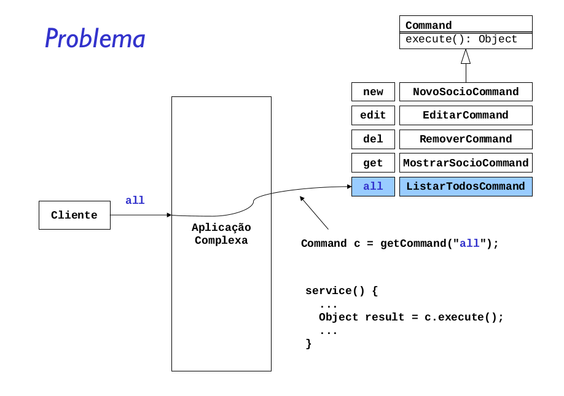
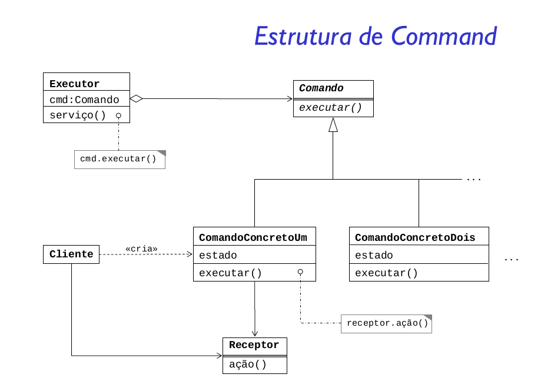

Encapsular uma solicitação como objeto, desta forma permitindo parametrizar cliente com diferentes
solicitações, enfileirar ou fazer o registro de solicitações e suportar operações que podem ser desfeitas.

O Command permite encapsular um objeto e fornecer a outro uma forma de executar o método do objeto encapsulado
de forma dinâmica, o objeto que da inicio a ação é um controle remoto que tem um comando definido em um dos
seus slots , responsável pela execução do objeto alvo, o controle remoto, pode ter vários slots e nós podemos 
configurar cada slot uma operação diferente, e em qualquer momento modificar a ação do slot configurando outra
operação;

O padrão tem um conceito muito simples, utiliza-se apenas da herança para agrupar classes e obrigar que todas tenham uma mesma interface em comum. A primeira vista o padrão pode ser confundido com o padrão Template Method, pois ambos utilizam a herança para unificar a interface de várias classes.

A diferença básica é que no padrão Command não existe a ideia de um “algoritmo” que será executado. No padrão Template Method as subclasses definem apenas algumas operações, sem alterar o esqueleto de execução. O padrão Command não oferece uma maneira de execução de suas subclasses, apenas garante que todas executem determinada requisição.

o padrão Command também poderia ser utilizado para desfazer operações, antes que elas sejam executadas de fato. Por exemplo, caso o cliente desista das compras, um método poderia desfazer/cancelar as alterações. Desta mesma forma poderíamos manter o controle sobre as mudanças, criando assim um log das operações.

As vantagens do padrão são: a facilidade de extensão da arquitetura, permitindo adicionar novos commands sem efeitos colaterais; e o bom nível de desacoplamento entre objetos, separando os objetos que possuem os dados dos que manipulam os dados.

Um problema que pode ocorrer ao utilizar o padrão Command é a complexidade dos comandos crescer demais. Por exemplo, se todos os commands precisam realizar várias ações, como: manter a persistência nas alterações, oferecer uma maneira de desfazer alterações, etc. Neste caso pode ser viável a utilização de um agrupamento de comandos, com o padrão Composite.