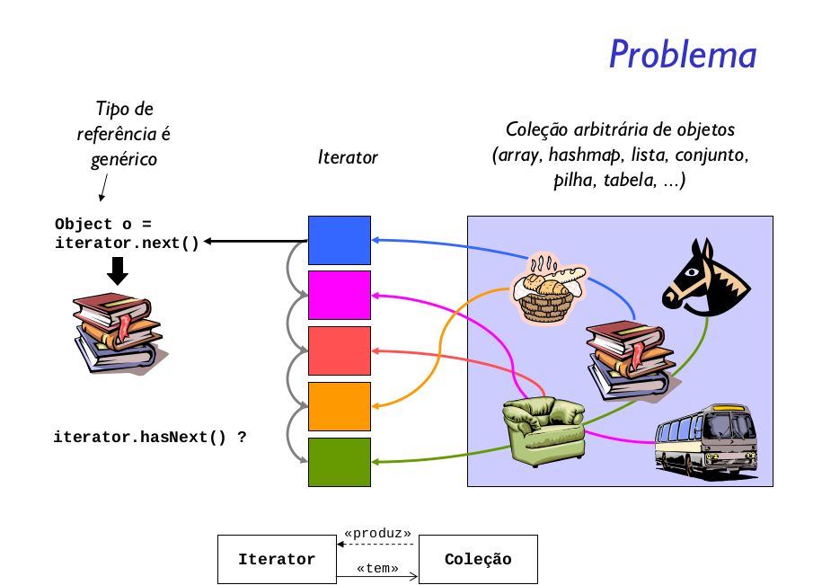

Prover uma maneira de acessar os elementos de um objeto
agregado seqüencialmente sem expor sua representação
interna.

### Funcionamento
O Padrão de Projeto Iterator tem como objetivo encapsular uma iteração. O Padrão de Projeto Iterator depende de uma interface chamada Iterator, conforme pode ser vista abaixo:

### Vantagens do Padrão Iterator
O Padrão Iterator encapsula as implementações das iterações, a partir de agora não precisamos mais ver que tipo de coleção está sendo utilizada pelos objetos como um ArrayList ou um HashTable. Com a utilização do Padrão Iterator precisamos apenas de um loop para lidarmos polimorficamente com qualquer coleção de itens desde que ela apenas implemente o Iterator. Anteriormente também estávamos com o código vinculado a classes como ArrayList, agora usamos apenas uma interface (Iterator), lembre-se de programar sempre para interfaces.

### Conclusão
O Padrão Iterator permite o acesso sequencial aos elementos de um agregado sem expor a sua implementação subjacente. O Padrão Iterator também é responsável por toda a tarefa de iteração, retirando assim do agregado a responsabilidade, dessa forma simplificando a interface e a sua implementação deixando a responsabilidade onde deveria estar. Por fim, o padrão Iterator nos remete a dois princípios de bons projetos que é da alta coesão com as classes projetadas em torno de um conjunto de funções relacionadas entre si e da Responsabilidade Única, onde a classe possui uma única finalidade ou responsabilidade. Apesar da coesão ter um conceito mais genérico, ela está estritamente relacionada com o conceito da Responsabilidade Única.