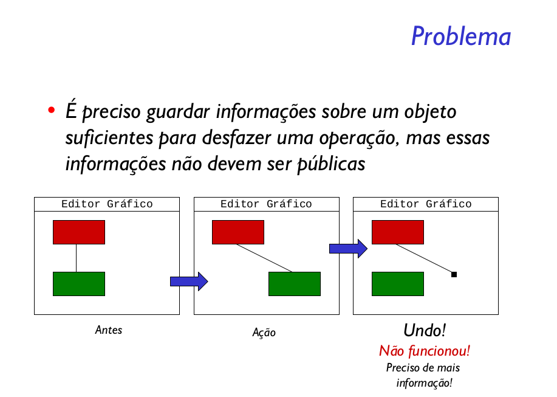
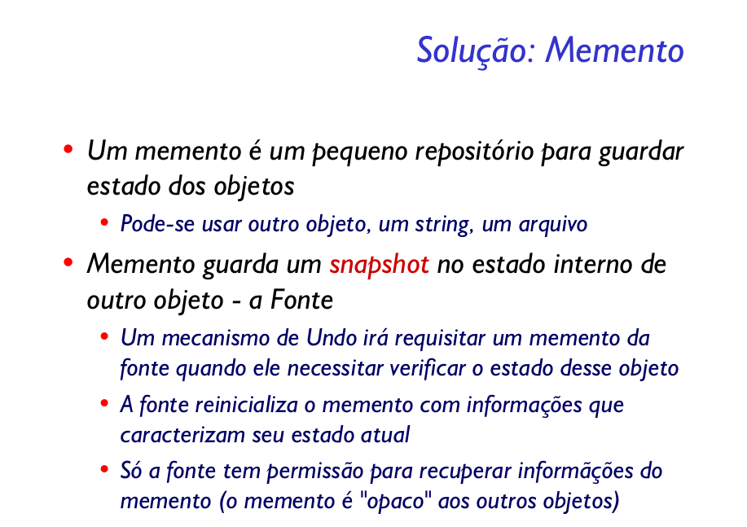

Sem violar o encapsulamento, capturar e externalizar um estado interno de um objeto, de maneira que o objeto possa ser restaurado para esse estado mais tarde.

O padrão Memento oferece uma maneira simples de salvar estados internos de um objeto. Basta salvar todas as informações necessárias em Memento e mais tarde recuperá-las. Ele transfere a responsabilidade de fornecer maneiras de acessar o estado para o objeto Memento, deixando o Originator (no nosso exemplo, a classe Texto) livre destas preocupações.

Um desvantagem fácil de ser notada é que armazenar a lista de Memento pode ser caro, computacionalmente. Assim, caso o estado seja muito complexo, pode-se utilizar uma classe intermediária que armazena o estado para simplificar a arquitetura, mas não a complexidade. Em muitos editores é comum notar que é possível configurar a quantidade de espaço a ser utilizado para salvar estados do programa. Assim, ao salvar um Memento, o Caretaker pode verificar se o limite foi atingido e eliminar os Memento mais antigos, caso seja necessário.

Outra desvantagem é que é necessário tomar cuidado para que não seja possível ter acesso ao objeto Memento, pois nada impede que apenas o Caretaker, ou o Originator acessem o estado do Memento. Em C++ é possível utilizar o operador friend para que os campos privados sejam visíveis somente em algumas classes.
