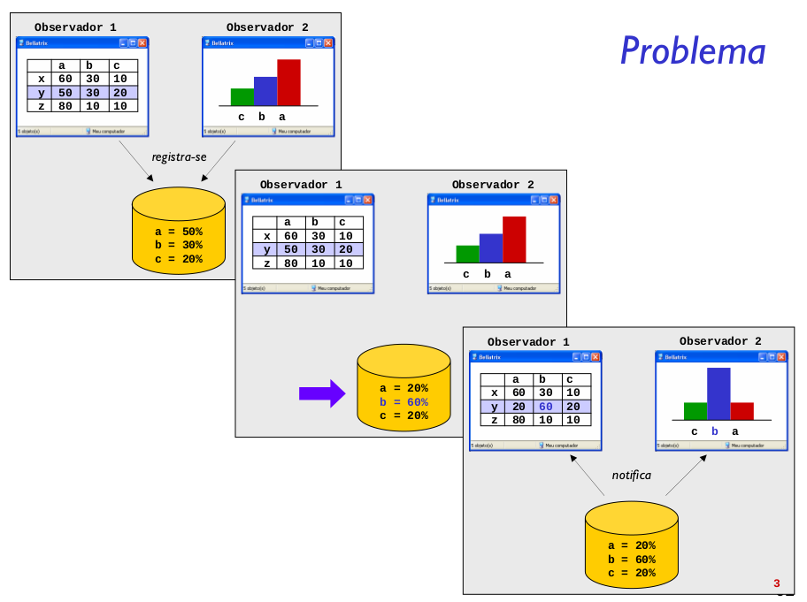

Definir uma dependência um para muitos entre objetos, de maneira que quando um objeto muda de estado todos os seus dependentes são notificados e atualizados automaticamente.

Na nomenclatura do padrão Observer temos os duas classes principais: Subject e Observer. O Subject é o que mantém os dados compartilhados e a lista de observadores que compartilham o dado. O Observer é o que faz utilização dos dados compartilhados e deve ser atualizado a cada modificação.

No nosso exemplo o padrão Observer oferece uma excelente maneira de compartilhar um recurso, utilizando uma técnica parecida com o broadcast, onde todos os observres cadastrados em um subject são notificados sobre mudanças.

Ao realizar uma mudança é necessário ter cuidado, pois não se sabe exatamente os efeitos desta mudança nos seus observers ou o custo das atualizações nos observers. Caso as mudanças sejam muito complexas ou muito custosas pode ser interessante implementar uma estrutura intermediária para gerenciar os subjects e observers e suas mudanças.

Outro motivo para se utilizar uma estrutura intermediária entre subject e observer é quando existem muitos subjects e muitos observers interligados. Uma estrutura para mapear subjects e observers pode ser mais eficiente que uma lista de observers em cada subject.

Essa estrutura intermediária muitas vezes pode ser uma instância do padrão Mediator. Também é interessante que esta classe intermediária seja uma instância do padrão Singleton, pois é interessante que apenas um objeto centralize o controle de subjects e observers.

As subclasses de Subject vão definir como será a inserção e remoção de observers, e como estes observers serão notificados. Além disso ela deve prover uma maneira dos observers acessarem os dados compartilhados, definindo assim os métodos de “getState()” e “setState()”