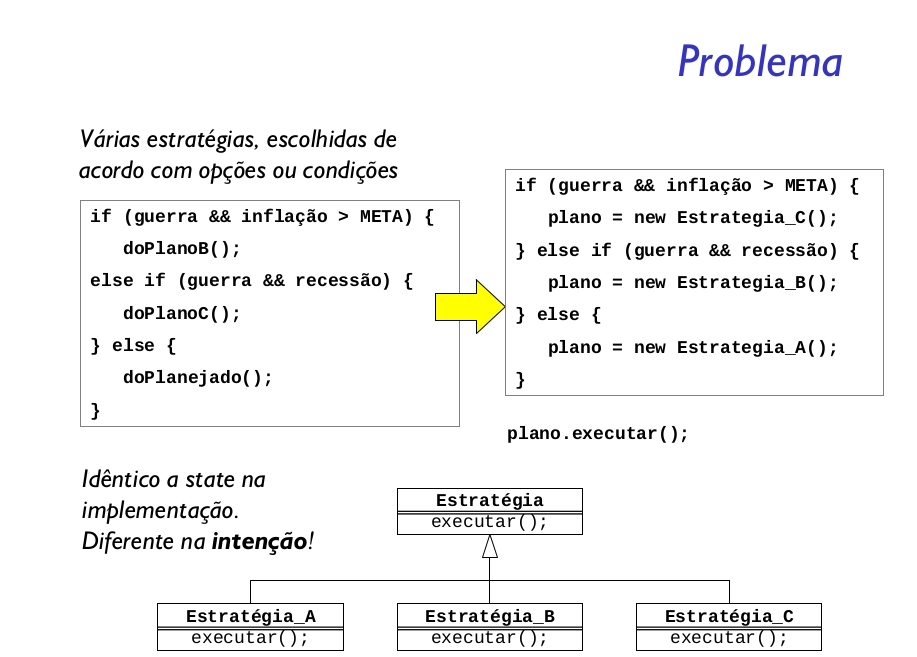
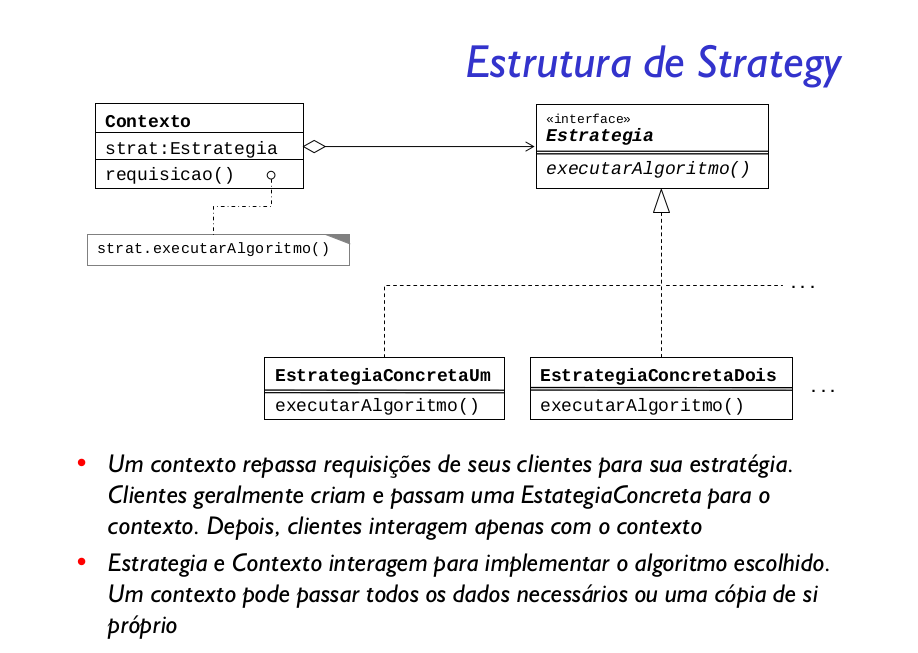

Definir uma família de algoritmos, encapsular cada uma delas e torná-las intercambiáveis. Strategy permite que o algoritmo varie independentemente dos clientes que o utilizam

O padrão Strategy, além de encapsular os algoritmos da mesma família também permite a reutilização do código.
Outra vantagem é a facilidade para extensão das funcionalidades. 

O livro Padrões de Projeto da série Use a Cabeça fala do padrão Strategy como se fossem comportamentos, ou seja, uma família de algoritmos que simulam determinado comportamento. Neste livro é dado o exemplo da classe genérica Duck que possui os comportamentos de Fly e Quack. Assim cada tipo de Duck utiliza um comportamento Fly e Quack próprio.

Esta é outra nomenclatura para o padrão. As classes de estratégia são chamadas de Comportamento e a classe que utiliza o comportamento é chamada de Contexto. Ou seja, para um determinado Contexto você pode aplicar um conjunto de comportamentos.

#### Problemas com o Strategy

Quando outra pessoa está utilizando seu código ela pode escolher qualquer comportamento para o contexto que ela deseja aplicar. Isso pode ser visto como um potencial problema, pois o usuário do seu código deve conhecer bem a diferença entre as estratégias para saber escolher qual se aplica melhor ao contexto dele.

