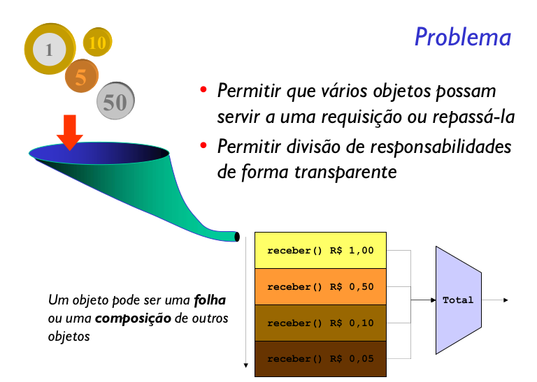
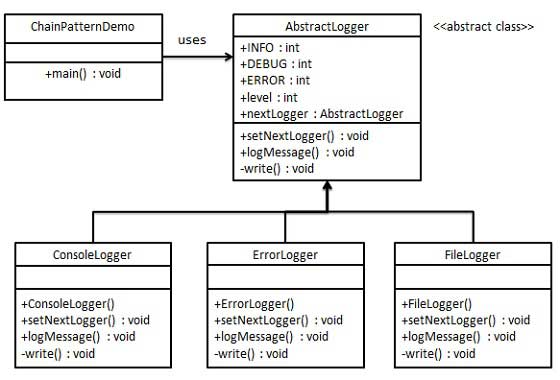

Evita acoplar o remetente de uma requisição ao seu
destinatário ao dar a mais de um objeto a chance de servir
a requisição. Compõe os objetos em cascata e passa a
requisição pela corrente até que um objeto a sirva.

Objetivo desse padrão é encadear objetos receptores sem que haja uma dependência entre eles.

O padrão Chain of Responsibility fornece uma maneira de tomar decisões com um fraco acoplamento. Perceba que a estrutura de cadeia não possui qualquer informação sobre as classes que compõem a cadeia, da mesma forma, uma classe da cadeia não tem nenhuma noção sobre o formato da estrutura ou sobre elementos nela inseridos.

Assim, é possível variar praticamente todos os componentes sem grandes danos ao projeto. Cada elemento implementa sua própria maneira de responder a requisição, e estas podem ser alteradas facilmente.

O problema é que é preciso tomar cuidado para garantir que as chamadas sejam realmente respondidas. No exemplo foi feita uma verificação para saber se o próximo elemento é nulo, para evitar uma acesso ilegal. Mas esta é uma solução para este problema específico. Cada problema exige o seu próprio cuidado.