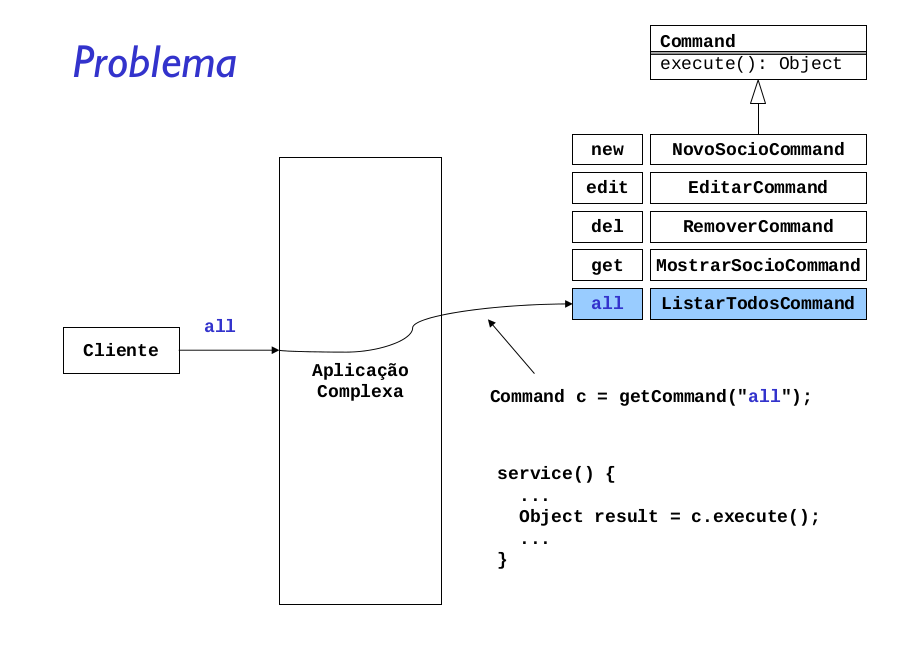
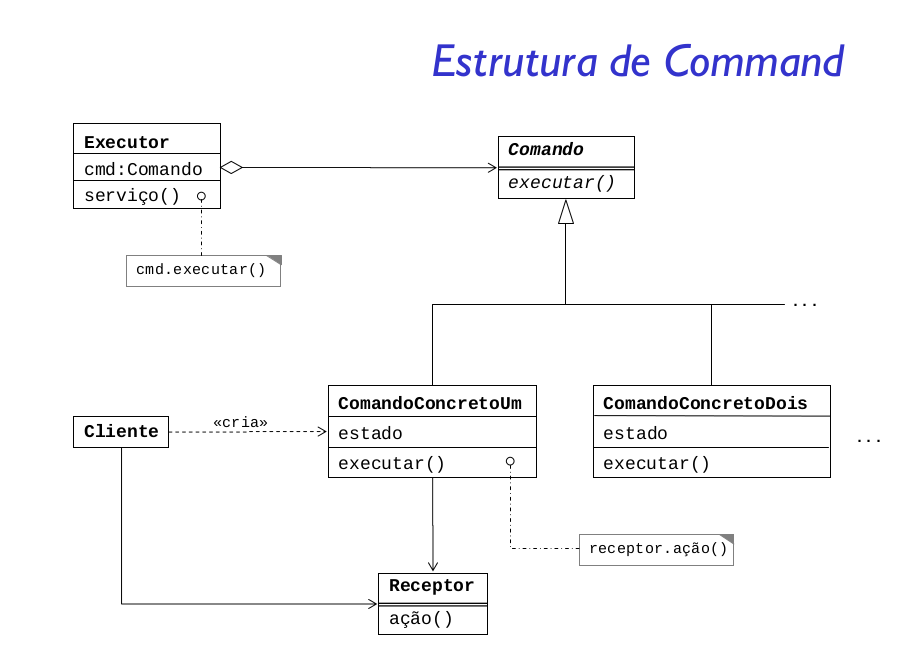

Encapsular uma solicitação como objeto, desta forma permitindo parametrizar cliente com diferentes solicitações, enfileirar ou fazer o registro de solicitações e suportar operações que podem ser desfeitas.

O padrão tem um conceito muito simples, utiliza-se apenas da herança para agrupar classes e obrigar que todas tenham uma mesma interface em comum. A primeira vista o padrão pode ser confundido com o padrão Template Method, pois ambos utilizam a herança para unificar a interface de várias classes.

A diferença básica é que no padrão Command não existe a ideia de um “algoritmo” que será executado. No padrão Template Method as subclasses definem apenas algumas operações, sem alterar o esqueleto de execução. O padrão Command não oferece uma maneira de execução de suas subclasses, apenas garante que todas executem determinada requisição.

As vantagens do padrão são: a facilidade de extensão da arquitetura, permitindo adicionar novos commands sem efeitos colaterais; e o bom nível de desacoplamento entre objetos, separando os objetos que possuem os dados dos que manipulam os dados.

Um problema que pode ocorrer ao utilizar o padrão Command é a complexidade dos comandos crescer demais. Por exemplo, se todos os commands precisam realizar várias ações, como: manter a persistência nas alterações, oferecer uma maneira de desfazer alterações, etc. Neste caso pode ser viável a utilização de um agrupamento de comandos, com o padrão Composite.
