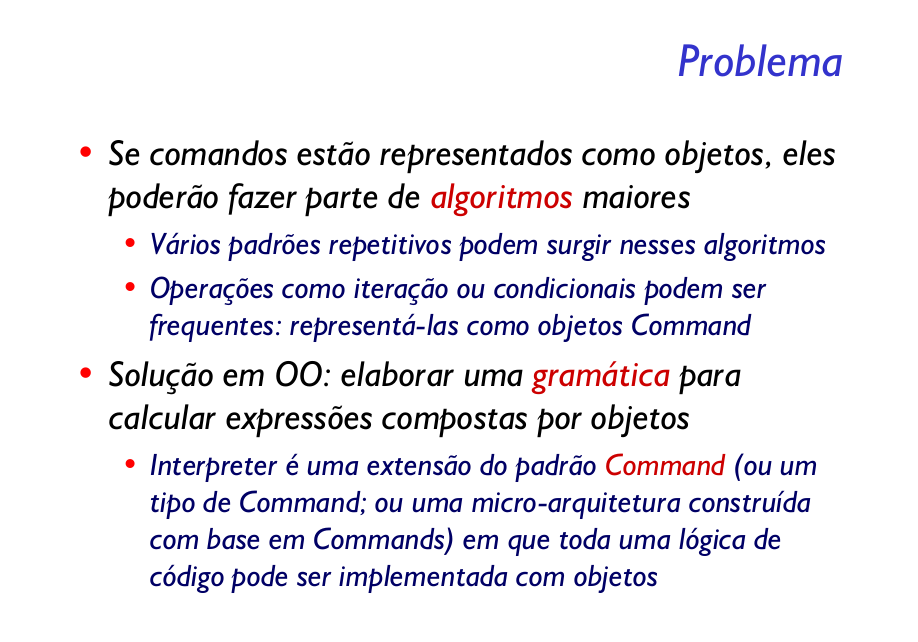

Dada uma linguagem, definir uma representação para sua gramática juntamente com um interpretador
que usa a representação para interpretar sentenças dessa linguagem.

A maior dificuldade em utilizar o Interpreter é na verdade conseguir modelar uma gramática para o problema. Feito isso, cada regra da gramática acaba se tornando uma subclasse da expressão abstrata. Desta maneira é fácil implementar a gramática, as classes interpretadoras ficam bem simples.

Outro ponto é a facilidade de alteração e extensão da gramática, pois basta criar novas classes que implementem as novas regras. Suponha que agora a gramática precisa abranger números de cinco dígitos? Basta criar uma nova classe que defina essas regras e alterar o método de interpretação.

