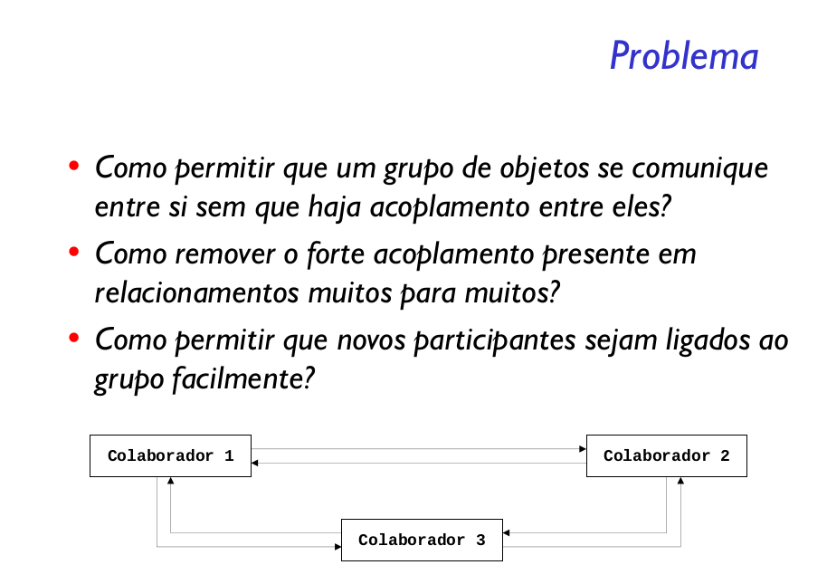
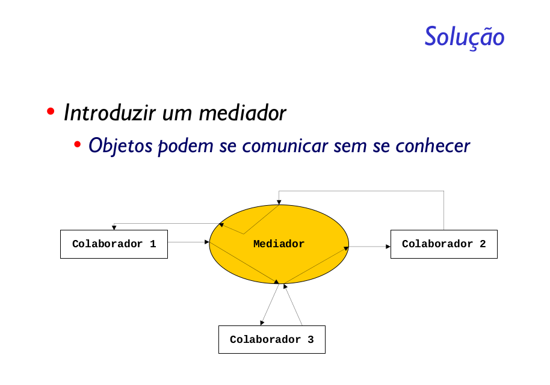

Definir um objeto que encapsula a forma como um conjunto de objetos interage. O Mediator promove o acoplamento fraco ao evitar que os objetos se refiram uns aos outros explicitamente e permitir variar suas interações independentemente.

Quando uma situação em que um relacionamento muitos para muitos é necessário em Banco de Dados, uma boa prática é criar uma tabela intermediária e deixar que ela relaciona uma entidade com outras várias e vice-e-versa. Esta é a ideia do padrão Mediator.

Pela intenção podemos perceber que o Mediator atua como um mediador entre relacionamentos muitos para muitos, ao evitar uma referência explicita aos objetos. Outra vantagem que podemos notar é também que ele concentra a maneira como os objetos interagem.

O padrão Mediator consiste de duas figuras principais: o Mediator e o Colleague. O Mediator recebe mensagens de um Colleague, define qual protocolo utilizar e então envia a mensagem. O Colleague define como receberá uma mensagem e envia uma mensagem para um Mediator.

O padrão Mediator tem como principal objetivo diminuir a complexidade de relacionamentos entre objetos, garantindo assim que todos fiquem mais livres para sofrer mudanças, bem como facilitando a introdução de novos tipos de objetos ao relacionamento.