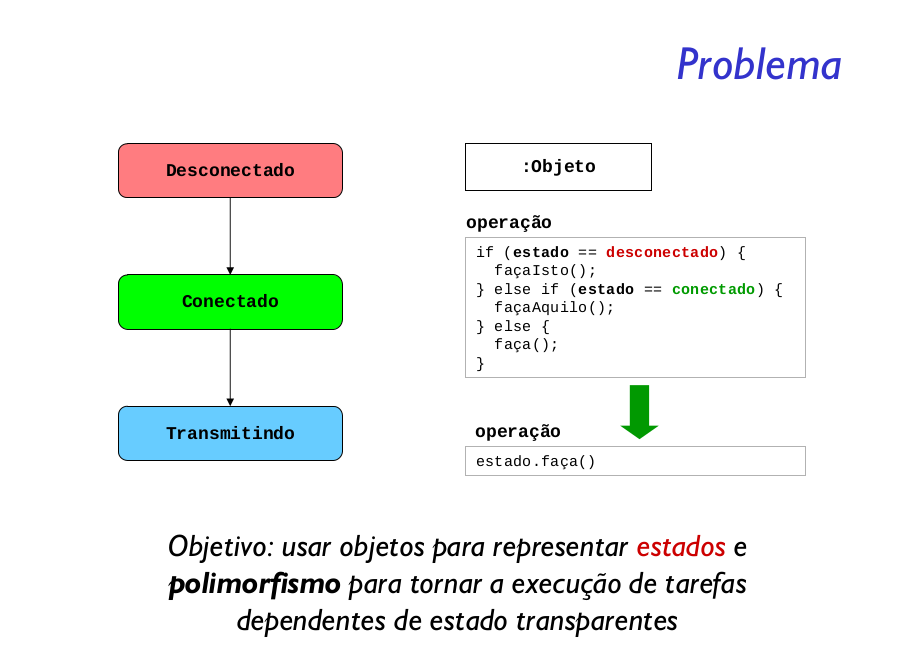

Permite a um objeto alterar seu comportamento quando seu estado interno muda. O objeto parecerá ter mudado de classe.

O padrão encapsula os estados em classes separadas e delega as tarefas para o objeto que representa o estado atual, nós sabemos que os comportamentos mudam juntamento com o estado interno.

o padrão é utilizado quando se precisa isolar o comportamento de um objeto, que depende de seu estado interno. O padrão elimina a necessidade de condicionais complexos e que frequentemente serão repetidos. Com o padrão cada “ramo” do condicional acaba se tornando um objeto, assim você pode tratar cada estado como se fosse um objeto de verdade, distribuindo a complexidade dos condicionais.

Incluir novos estados também é muito simples, basta criar uma nova classe e atualizar as operações de transição de estados. Com a primeira solução seriam necessários vários milhões de ifs novos e a alteração dos já existentes, além do grande risco de esquecer algum estado. Outra grande vantagem é que fica claro, com a estrutura do padrão, quais são os estados e quais são as possíveis transições.

O padrão State não define aonde as transições ocorrem, elas podem ser colocadas dentro das classes de estado ou dentro da classe que armazena o estado. 

A principal vantagem desta solução é que fica mais simples adicionar os estados, cada novo estado define suas transições. O problema é que assim cada classe de estado precisa ter conhecimento sobre as outras subclasses, e se alguma delas mudar, é provável que a mudança se espalhe.

É comum que objetos estados obedeçam a outros dois padrões: Singleton e Flyweight. Estados singleton são capazes de manter informações, mesmo com as constantes trocas de estados. Estados Flyweight permitem o compartilhamento entre objetos que vão utilizar a mesma máquina de estado.

O padrão State tem semelhanças com outros dois padrões: Strategy e Bridge. Falando primeiro sobre o Strategy, note que a ideia é muito parecida: eliminar vários ifs complexos espalhados utilizando subclasses. A diferença básica é que o State é mais dinâmico que o Strategy, pois ocorrem várias trocas de objetos estados, os próprios objetos estados realizam as transições.

A intenção do Bridge é permitir que tanto a implementação quanto a interface possam mudar independentemente. No State a ideia é realmente mudar o comportamento de um objeto.

