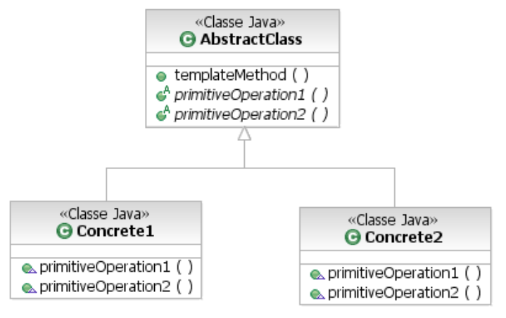

Definir o esqueleto de um algoritmo em uma operação, postergando alguns passos para as subclasses. Template Method permite que subclasses redefinam certos passo de um algoritmo sem mudar a estrutura do mesmo.

### Funcionamento

O Padrão de Projeto Template Method define os passos de um algoritmo e permite que a implementação de um ou mais desses passos seja fornecida por subclasses. Assim, o Template Method protege o algoritmo e fornece métodos abstratos para que as subclasses possam implementá-los.

A definição oficial do padrão Template Method é: “O Padrão Template Method define o esqueleto de um algoritmo dentro de um método, transferindo alguns de seus passos para as subclasses. O Template Method permite que as subclasses redefinam certos passos de um algoritmo sem alterar a estrutura do próprio algoritmo”.

Portanto, o padrão Template Method basicamente oferece um método que define um algoritmo (uma sequência de passos) que pode, por sua vez, ser definido como abstrato para posteriormente ser implementado por uma subclasse. Pode-se notar que a estrutura do algoritmo fica inalterada mesmo com as subclasses fazendo parte da implementação.

O Diagrama de classe abaixo mostra mais detalhes sobre o funcionamento do padrão Template Method.

No diagrama de classe acima temos a classe AbstractClass contendo o método “templateMethod()” que possui o algoritmo e quel define os métodos “primitiveOperation1()” e “primitiveOperation2()” que são abstratos. As classes concretas Concrete1 e Concrete2 implementam os métodos abstratos que serão chamados quando “templateMethod()” precisar delas. Vale salientar que o método “templateMethod()” é final, ou seja, ele não pode ser sobrescrito, seu algoritmo não pode ser mexido. Já os métodos “primitiveOperation1()” e “primitiveOperation2()” podem ser sobrescritos. Além disso, ainda poderíamos ter um método concreto ou ainda um método final que não poderia ser sobrescrito e seria utilizado no algoritmo do templateMethod().

### Utilização do Template Method nas API’s Java

O Padrão Template Method também é utilizado nas API’s do Java, como na API Swing onde a classe JFrame define o método paint() como abstrato para ser implementado nas subclasses que estendem JFrame. A substituição do conteúdo de paint() permite que você se conecte ao algoritmo de JFrame para exibir sua área da tela e incorporar a sua própria saída gráfica ao JFrame. Os Applets também utilizam o padrão Template Method através dos métodos init(), start(), stop(), destroy(), e outros.

### Conclusão

O Padrão Template Method nos permite reutilizar código sem perder o controle do nossos algoritmos. No Template Method são definidos passos de um algoritmo, permitindo que alguns desses passos sejam implementados por subclasses. Na classe abstrata temos métodos abstratos, concretos e finais. O Template Method é bastante utilizado inclusive na API Java, como pudemos constatar.

