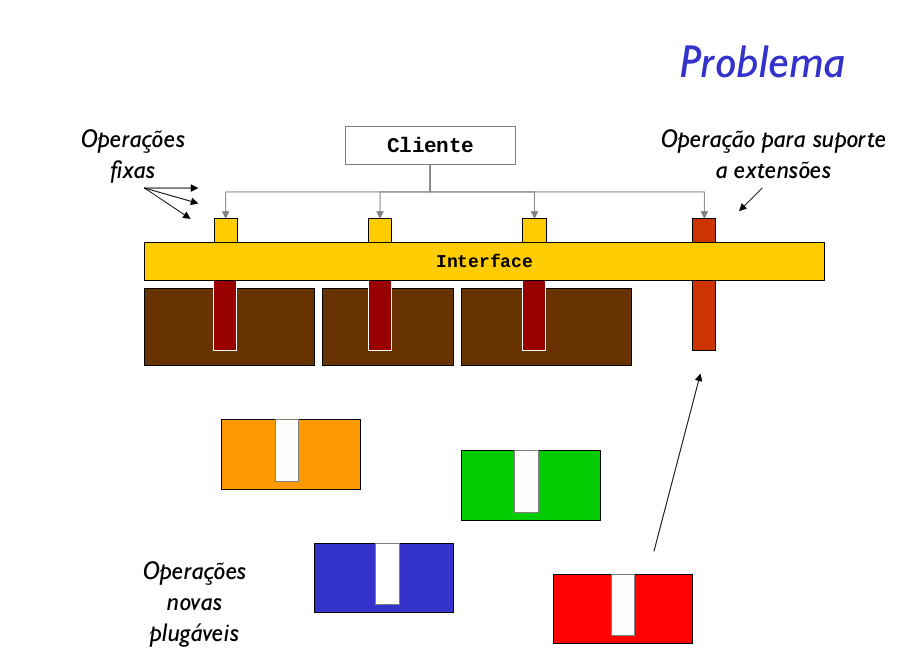
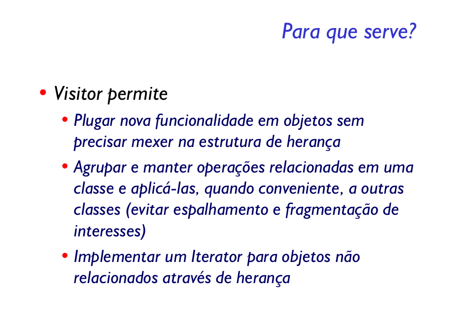

Representar uma operação a ser executada nos elementos de uma estrutura de objetos. Visitor permite definir uma nova operação sem mudar as classes dos elementos sobre os quais opera.

 A sua ideia é separar as operações que serão executadas em determinada estrutura de sua representação. Assim, incluir ou remover operações não terá nenhum efeito sobre a interface da estrutura, permitindo que o resto do sistema funcione sem depender de operações específicas.
 

O padrão Visitor oferece uma excelente alternativa quando é necessário realizar uma série de operações sobre um conjunto de dados, dado que estas operações são pouco estáveis, ou seja, sofrem alterações constantemente. 

Assim, para decidir pela utilização do padrão Visitor é necessário ter certeza de que a estrutura dos elementos seja bem estável (não sofra alterações ao longo do projeto) e que a interface desta estrutura permita acesso suficiente para os objetos visitantes. Elementos podem ter interfaces diferentes, contato que estas interface sejam estáveis e provejam acesso às classes visitantes.

Outro detalhes importante é que a estrutura de dados depende da interface das classes visitantes. Já a classe visitante precisa ter conhecimento sobre os vários tipo de elementos, pois cada um deles poderá ser visitado de uma maneira diferente. Para exemplificar esta afirmação, suponha o seguinte cenário:

São utilizadas várias estruturas de dados, como vetores, listas, árvores binárias, heaps, etc. Todas estas classes oferecem uma interface simples: adicionar, remover e buscar elementos. Já um método visitante atuaria de maneiras diferentes em cada uma delas. O método de percurso de uma árvore binária é diferente do método de percurso de uma lista, ou de uma árvore B. Assim, na classe visitante, é preciso ter um método para visitar cada um destes tipos de estruturas, embora todas elas tenham uma interface em comum.

Se por um lado o padrão facilita a adição de novas operações sobre o conjunto de estruturas, fica muito difícil, uma vez que o projeto está utilizando o padrão, incluir novos tipos de elementos, pois cada novo elemento vai gerar alterações em todas as classes visitantes.

Padrões que utilizem estruturas de dados para representação podem utilizar o padrão Visitor, por exemplo, uma estrutura Composite ou Interpreter, pode oferecer um método de visita e atribuir para as classes visitantes a responsabilidade das operações sobre seu conjunto de dados.

Já que o padrão Visitor é utilizado para percorrer um conjunto de dados, qual a diferença dele e do padrão Iterator? A intenção do padrão Iterator é fornecer uma maneira de percorrer os elementos de uma estrutura, expondo seus elementos e deixando para o cliente a responsabilidade de operar sobre estes. O padrão Visitor oferece operações sobre elementos, sem expor seu conteúdo, ou delegar responsabilidades extras para o cliente.

