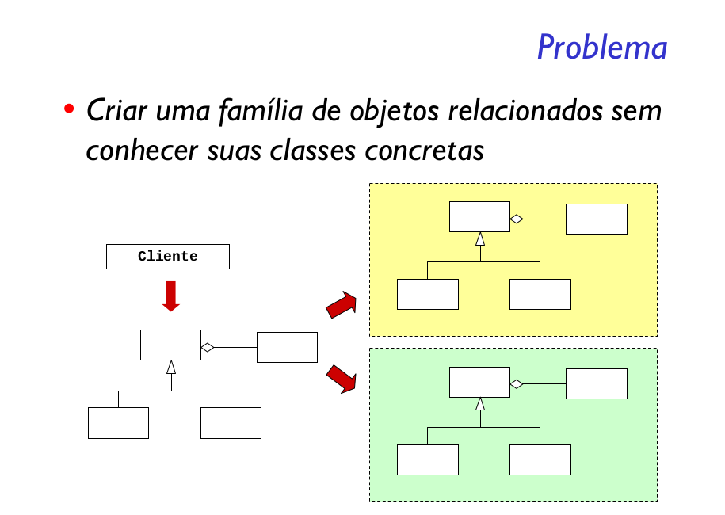
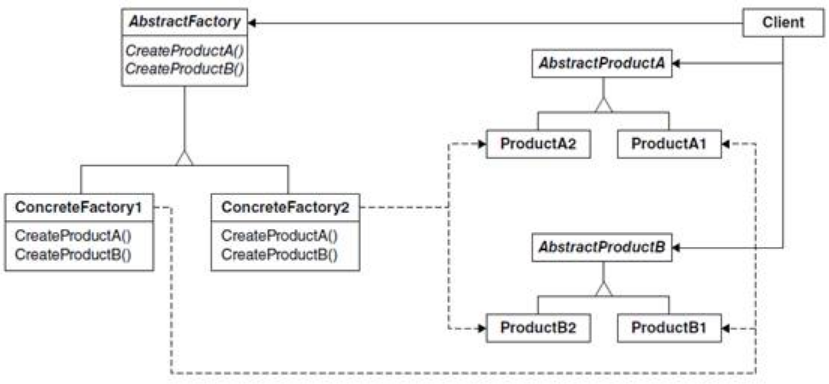

Fornecer uma interface para criação de famílias de objetos relacionados ou dependentes sem especificar suas classes concretas.

Assim, o Abstract Factory oferece o encapsulamento de um grupo de fábricas e controla como o cliente acessará essas fábricas.

O Abstract Factory é muito similar ao Factory Method, alias ele tem na composição dele a implementação de vários Factory Method. Por que isso? Porque o Abstract Factory trabalha com a criação de famílias de objetos.

