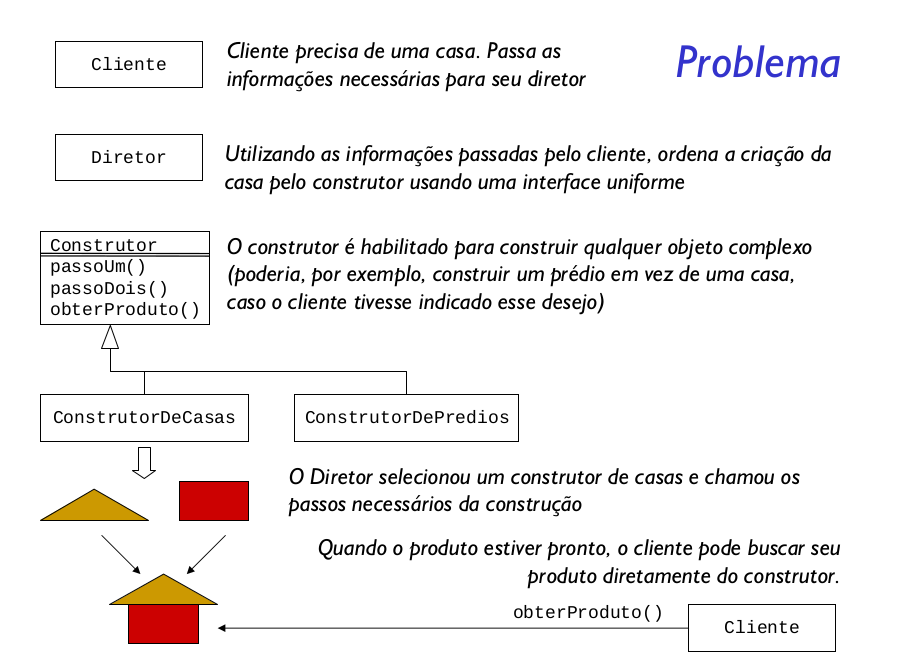

Separar a construção de um objeto complexo de sua representação de modo que o mesmo processo de construção possa criar diferentes representações.

Separar a construção da representação segue a mesma ideia dos padrões Factory Method e Abstract Factory. No entanto o padrão Builder permite separar os passos de construção de um objeto em pequenos métodos. 

### Quando usar?
- Builder permite que uma classe se preocupe com
apenas uma parte da construção de um objeto. É útil
em algoritmos de construção complexos
  - Use-o quando o algoritmo para criar um objeto complexo
precisar ser independente das partes que compõem o
objeto e da forma como o objeto é construído
- Builder também suporta substituição dos
construtores, permitindo que a mesma interface seja
usada para construir representações diferentes dos
mesmos dados
    - Use quando o processo de construção precisar suportar
representações diferentes do objeto que está sendo
construído