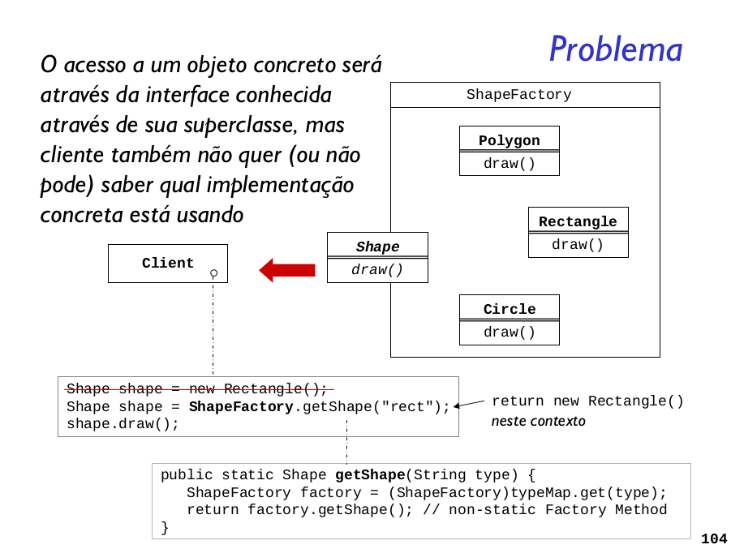

Definir uma interface para criar um objeto mas deixar que
subclasses decidam que classe instanciar. Factory Method
permite que uma classe delegue a responsabilidade de
instanciamento às subclasses.

### Como implementar?
- É possível criar um objeto sem ter
conhecimento algum de sua classe concreta?
- Esse conhecimento deve estar em alguma parte
do sistema, mas não precisa estar no cliente
- FactoryMethod define uma interface comum para
criar objetos
- O objeto específico é determinado nas diferentes
implementações dessa interface
- O cliente do FactoryMethod precisa saber sobre
implementações concretas do objeto criador do
produto desejado

### Vantagens do Padrão Factory Method
O Factory Method é bastante utilizado em diversos projetos, até mesmo nos casos em que temos apenas um Creator, pois mesmo nessas condições o padrão nos oferece um meio de desligar a implementação de um Product. Adicionando ou alterando Products isso não irá afetar o Creator, pois eles não estão fortemente ligados.

Com o padrão Factory Method podemos encapsular o código que cria objetos. É muito comum termos classes que instanciam classes concretas e essa parte do código normalmente sofre diversas modificações, portanto nesses casos usamos um Factory Method que encapsula esse comportamento de instanciação.

Usando o Factory Method temos o nosso código de criação em um objeto ou método, evitando assim a duplicação e além disso temos um local único para fazer manutenção. O padrão também nos dá um código flexível e extensível para o futuro.

### Conclusão
Como foi possível estudar neste artigo, o padrão Factory Method oferece um modo de encapsular as instanciações de tipos concretos. O Creator nos oferece um método para criação de objetos, os demais métodos operam em cima das subclasses de Creator, ou seja, os ConcreteCreator, fabricados pelo factoryMethod. Além disso apenas os ConcreteCreator implementam o método de fábrica e criam Products como pode-se observar no diagrama de classe do padrão.