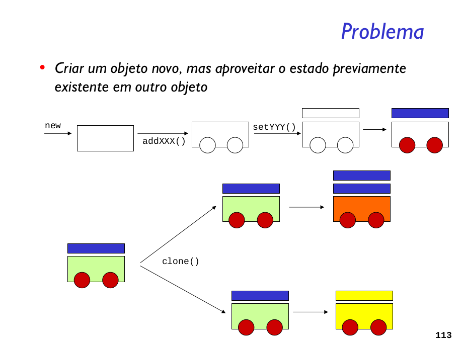

Especificar tipos de objetos a serem criados usando uma instância protótipo e criar novos objetos pela cópia desse protótipo.

O  padrão Prototype oferece as mesmas vantagens que outros padrões de criação: esconde os produtos do cliente, reduz o acoplamento e oferece maior flexibilidade para alterações nas classes produtos.

A diferença básica deste padrão é a flexibilidade. Por exemplo: o cliente instancia vários protótipos, quando um deles não é mais necessário, basta removê-lo. Se é preciso adicionar novos protótipos, basta incluir a instanciação no cliente. Essa flexibilidade pode ocorrer inclusive em tempo de execução.

O padrão Prototype também poderia fazer uso do Abstract Factory. Imagine que uma classe instância todos os protótipos e oferece métodos para copiar estes protótipos, ela seria uma fábrica de famílias de produtos.

Os produtos do Prototype podem ser alterados livremente apenas mudando os atributos, como no exemplo onde criamos um palio novo e um palio usado. No entanto é preciso garantir que o método de cópia esteja implementado corretamente, para evitar que a alteração nos valores mude todas as instâncias.

O padrão Prototype leva grande vantagem quando o processo de criação de seus produtos é muito caro, ou mais caro do que uma clonagem. No lugar de criar um Proxy para cada produto, basta definir, no objeto protótipo, como será essa inicialização, ou parte dela.

Um detalhe que torna o Prototype único em relação aos outros padrões de criação é que ele utiliza objetos para criar os produtos, enquanto os outros utilizam classes. Dependendo da arquitetura ou linguagem/plataforma do problema, é possível tirar vantagem deste comportamento.

