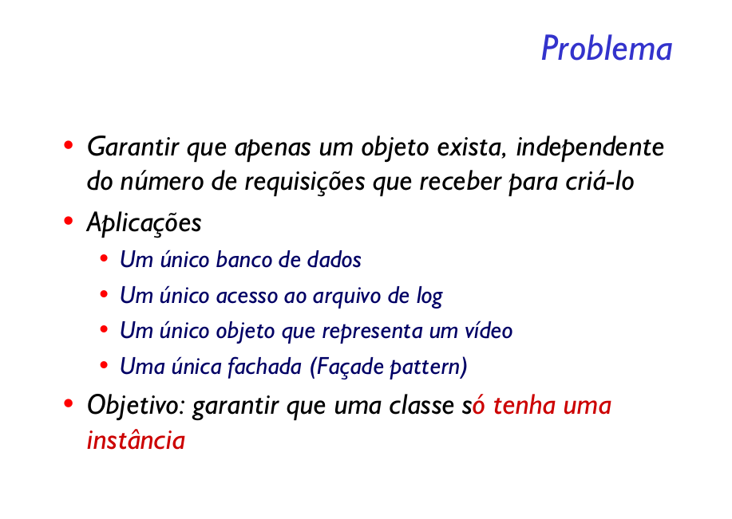

Garantir que uma classe tenha somente uma instância e fornece um ponto global de acesso para a mesma.

A maior vantagem do Singleton é unificar o acesso das instâncias. Além disso msotramos também que não é preciso nem mesmo criar referências para classes Singleton.
