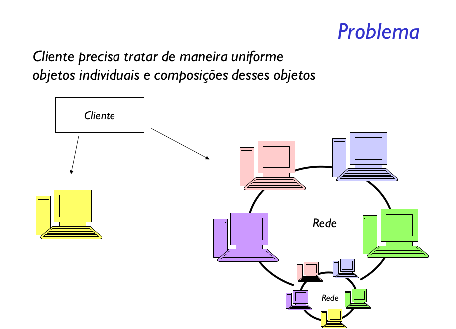
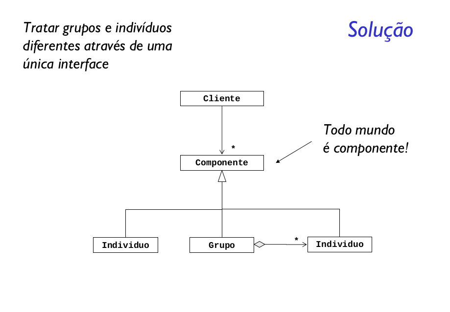

Compor objetos em estruturas de árvore para representar hierarquia partes-todo.
Composite permite aos clientes tratarem de maneira uniforme objetos individuais
e composições de objetos.

### Conseqüências do uso de Composite
- Objetos complexos podem ser compostos de objetos mais simples recursivamente
  - O cliente pode tratar objetos simples ou compostos da mesma forma: simplifica o cliente
- Facilita a adição de novos componentes: o cliente não tem que mudar com a adição de novos objetos (simples ou compostos)
  - Exemplo: no editor, como adicionar "Comentários" do tipo Word? O que pode estar contido num comentário?
- Do lado negativo, o projeto fica geral demais
  - É mais difícil restringir os componentes de um objeto composto
  - Por exemplo, acima, podemos compor linhas com linhas ou com documentos, etc. o que não faz sentido
  - O sistema de tipagem da linguagem não ajuda a detectar composições erradas
     - A solução é verificar em tempo de execução
     
### Considerações de implementação
- Adicionar referência ao pai de um objeto pode simplificar o caminhamento na estrutura
  - Onde adicionar a referência ao pai? Normalmente é colocada na classe abstrata Component
      - Exercício: colocar esta referência na figura acima
  - As subclasses herdam a referência e os métodos que a gerenciam
- Compartilhamento de componentes
  - Útil para reduzir as necessidades de espaço
  - Por exemplo, caracteres iguais poderiam compartilhar objetos
  - Fazer isso complica se os componentes só puderem ter um único pai
  - O padrão "flyweight" mostra como resolver a questão
- Maximização da interface de Component
  - Exercício para casa: certos livros colocam os métodos de gerenciamento de filhos apenas na classe Composite porque uma folha não tem filhos!
  - Você concorda ou discorda com a maximização da interface de Component? Por quê? Em outras palavras, é melhor ter uma interface idêntica para folhas e Composite (transparência para o cliente) ou interfaces diferentes (segurança de não fazer besteiras como adicionar um filho a uma folha, o que seria capturado pelo compilador)?
  - Se mantivermos as interfaces de Component e Composite diferentes, como o cliente pode testar se um objeto é folha ou composto?
- Onde são armazenados os filhos?
  - Nós os colocamos em Composite mas eles poderiam ser colocados em Component
  - A desvantagem é a perda de espaço para essa referência para folhas
- Quando os filhos devem ter uma ordem especial, deve-se cuidar deste aspecto
  - Usar um iterator é uma boa idéia
- Cache de informação
  - As classes Composite podem manter em cache informação sobre seus filhos de forma a eliminar (curto-circuitar) o caminhamento ou pesquisa nos filhos
  - Um exemplo: um Composite poderia manter em cache os limites do conjunto de filhos de forma a não ter que recalcular isso sempre
     - Quando um filho muda, a cache deve ser invalidada
     - Neste caso, os filhos devem conhecer o pai para avisar da mudança
- Como armazenar os filhos?
  - ArrayList, LinkedList, HashMap (qualquer coleção razoável)
  
### Quando usar?
- Sempre que houver necessidade de tratar um
conjunto como um indivíduo
- Funciona melhor se relacionamentos entre os
objetos for uma árvore
- Caso o relacionamento contenha ciclos, é preciso
tomar precauções adicionais para evitar loops
infinitos, já que Composite depende de
implementações recursivas