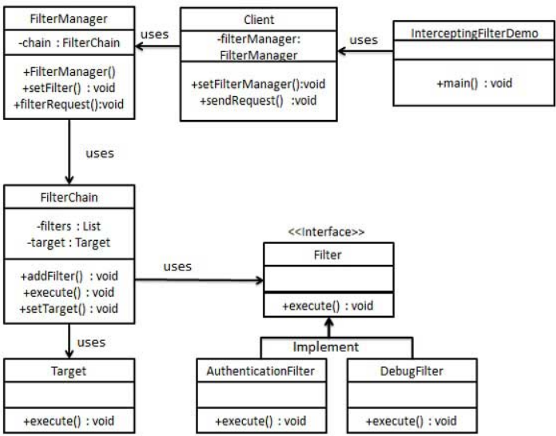

The intercepting filter design pattern is used when we want to do some pre-processing / post-processing with request or response of the application. Filters are defined and applied on the request before passing the request to actual target application. Filters can do the authentication/ authorization/ logging or tracking of request and then pass the requests to corresponding handlers. Following are the entities of this type of design pattern.

- Filter - Filter which will performs certain task prior or after execution of request by request handler.

- Filter Chain - Filter Chain carries multiple filters and help to execute them in defined order on target.

- Target - Target object is the request handler

- Filter Manager - Filter Manager manages the filters and Filter Chain.

- Client - Client is the object who sends request to the Target object.

