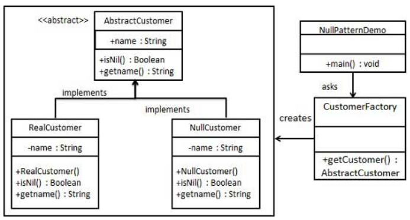

In Null Object pattern, a null object replaces check of NULL object instance. Instead of putting if check for a null value, Null Object reflects a do nothing relationship. Such Null object can also be used to provide default behaviour in case data is not available.

In Null Object pattern, we create an abstract class specifying various operations to be done, concrete classes extending this class and a null object class providing do nothing implemention of this class and will be used seemlessly where we need to check null value.

