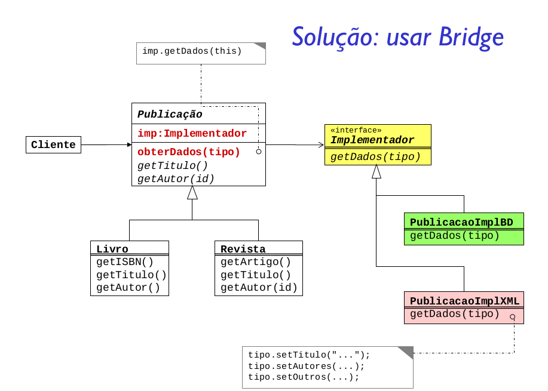
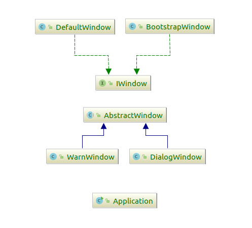

Desacoplar uma abstração de sua implementação para que os dois possam variar independentemente.
Ou seja, o Bridge fornece um nível de abstração maior que o Adapter, pois são
separadas as implementações e as abstrações, permitindo que cada uma varie independentemente.

O  padrão Bridge provê um excelente nível de desacoplação
dos componentes. Tanto novas abstrações como novas plataformas podem ser acomodadas pelo
sistema sem grandes dificuldades, graças a extensibilidade do padrão.

Outro ponto que é comum a maioria dos padrões é a ocultação dos detalhes de implementação
do cliente, que fica independente de qualquer variação ou extensão que precise ser feita.

Um ponto que merece um certo cuidado é sobre a instanciação dos objetos, pois vimos que
é necessário especificar a abstração e utilizar uma implementação, assim o cliente precisa
conhecer bem as classes, e o que elas realizam para saber exatamente o que, quando e como fazer.

### Quando usar?
- Quando for necessário evitar uma ligação
permanente entre a interface e implementação
- Quando alterações na implementação não puderem
afetar clientes
- Quando tanto abstrações como implementações
precisarem ser capazes de suportar extensão através
de herança
- Quando implementações são compartilhadas entre
objetos desconhecidos do cliente