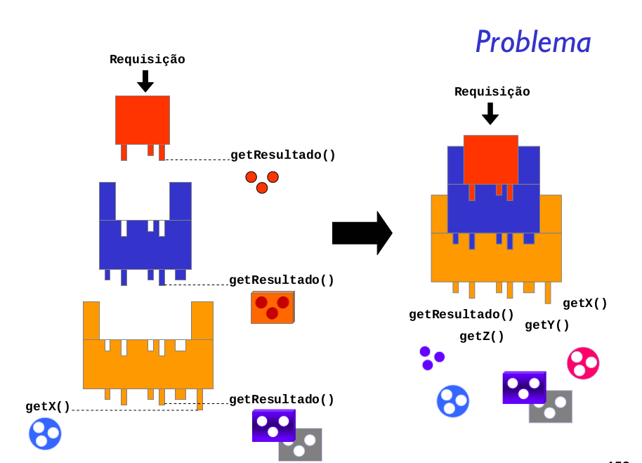

O Padrão Decorator anexa responsabilidades adicionais a um objeto dinamicamente. 
Os decoradores fornecem uma alternativa flexível de subclasse para estender a funcionalidade.

O Padrão Decorator tem como característica o seguinte:

- Os decoradores têm o mesmo supertipo que os objetos que eles decoram;
- Você pode usar um ou mais decoradores para englobar um objeto;
- Uma vez que o decorador tem o mesmo supertipo que o objeto decorado, podemos passar um objeto decorado no lugar do objeto original (englobado);
- O decorador adiciona seu próprio comportamento antes e/ou depois de delegar o objeto que ele decora o resto do trabalho;
- Os objetos podem ser decorados a qualquer momento, então podemos decorar os objetos de maneira dinâmica no tempo de execução com quantos decoradores desejarmos.

