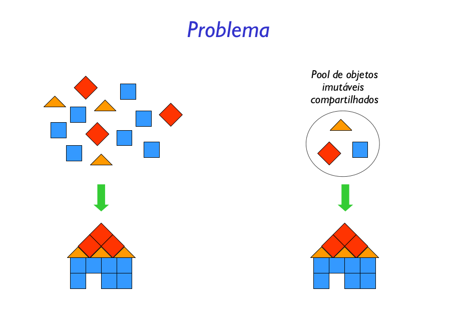

Usar compartilhamento para suportar grandes quantidades
de objetos refinados eficientemente.

A solução implementada pelo padrão Flyweight é bem intuitiva. No entanto vale a pena comentar alguns detalhes. Percebeu que, na classe fábrica fica centralizado o acesso a todos os objetos compartilhados? O aconteceria se houvessem duas ou mais instâncias desta classe? Seriam criados vários objetos, sem nenhuma necessidade.

Para evitar este problema vale a pena dar uma olhada em outro padrão, o Singleton. Aplicando este padrão na classe fábrica, garantimos que apenas uma instância dela será utilizada em todo o projeto.

O ponto fraco do padrão é que, dependendo da quantidade e da organização dos objetos a serem compartilhados, pode haver um grande custo para procura dos objetos compartilhados. Então ao utilizar o padrão deve ser analisado qual a prioridade no projeto, espaço ou tempo de execução.

Imagine que existe um grupo de objetos que serão compartilhados juntos, por exemplo, uma sequência de objetos do cenário. Nesta situação, existe uma combinação com outro padrão, o Composite. Com ele é possível agrupar um conjuntos de objetos Flyweight que serão compartilhados juntos.

Outro ponto de interesse é a instanciação de todos os objetos flyweight na classe fábrica. Suponha que algum objeto é instanciado, mas nunca é utilizado? Pode ser implementado uma estratégia de garbage collection, que controla o número de instâncias de um determinado objeto. Ao não ser mais utilizado, o objeto é liberado da memória, reduzindo mais ainda o espaço.

### Prós e Contras
- Flyweight é uma solução para construção de
aplicações usando objetos imutáveis
- Ideal para objetos que oferecem serviços (guardados em
caches e em pools)
- Ideal para objetos que podem ser usados para construir
outros objetos
- Problemas
- Possível impacto na performance (se houver muitas
representações diferentes, elas não podem ser alteradas, e
é preciso criar muitos objetos)