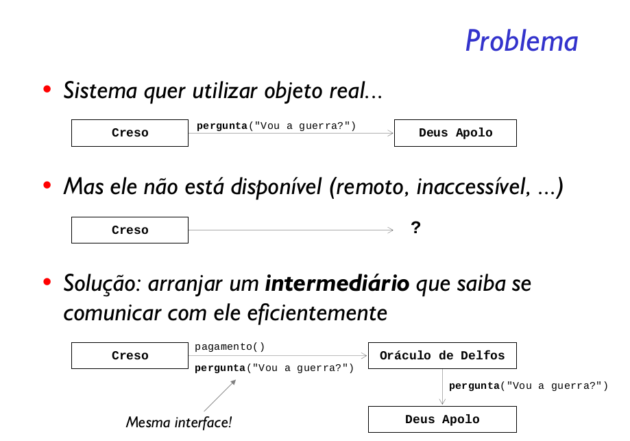

Prover um substituto ou ponto através do qual um objeto
possa controlar o acesso a outro.

### Estrutura de Proxy
- Cliente usa intermediário em vez de sujeito real
- Intermediário suporta a mesma interface que sujeito real
- Intermediário contém uma referência para o sujeito real e
repassa chamadas, possivelmente, acrescentando informações
ou filtrando dados no processo

### Tipos de proxy que podem ser utilizados:

- Protection Proxy: Controlam o acesso aos objetos, por exemplo, verificando se quem chama possui
a devida permissão.

- Virtual Proxy: mantem informações sobre o objeto real, adiando o acesso/criação do objeto
em si. O Proxy guarda algumas informações sobre um objeto, não necessitando criar o objeto em si para
acessar parte de suas informações.

- Remote Proxy: fornece um representante local para um objeto em outro espaço de endereçamento.
 Por exemplo, considere que precisamos codificar todas as solicitações enviadas ao banco do
exemplo anterior, utilizaríamos um Remote Proxy que codificaria a solicitação e só então
faria o envio.

- Smart Reference: este proxy é apenas um susbtituto simples para executar ações adicionais
quando o objeto é acessado, por exemplo para implementar mecanismos de sincronização de
acesso ao objeto original.

Cada proxy implicaria em um design diferente. No exemplo que citamos, consideramos que a
classe original não poderia ser modificada, por isso foi necessário extender seu comportamento.
No entanto, caso essa não fosse uma restrição poderíamos criar uma interface comum de acesso 
ao banco e utilizar ela em nosso programa, assim a implementação do programa ficaria
independente da implementação do banco em si (segura ou não).

A principal vantagem de utilizar o Proxy é que, ao utilizar um substituto, podemos fazer
desde operações otimizadas até proteção do acesso ao objeto. No entanto isto também pode
ser visto como um problema, pois, como a responsabilidade de um proxy não é bem definida
é necessário conhecer bem seu comportamento para decidir quando utilizá-lo ou não.

### Vantagens do Pattern Proxy

As principais vantagens de se utilizar o pattern Proxy são:

- Permite deixar transparente o local (endereço) do objeto real. O cliente não precisa conhecer se o objeto é remoto ou não, este tipo de proxy é conhecido como Remote Proxy.
- O pattern Proxy é muito utilizado pela tecnologia J2EE, pelo objeto “javax.ejb.EJBObject”, que representa uma referência remota ao EJB. Para o cliente que está utilizando a interface remote de um EJB, é transparente a chamada remota ao servidor, permitindo que complexos sistemas distribuídos possam ser desenvolvidos como se fossem chamadas locais.
- O consagrado framework Hibernate também utiliza o pattern Proxy, por exemplo, ao fazer o “lazy-loading”, técnica utilizado para acessar o banco de dados apenas quando for necessário. Muitas vezes quando trabalhamos com o Hibernate, e uma busca é realizada, por exemplo usando o método “session.load(id)”, um Proxy para o objeto real é retornado. Neste caso o objeto ainda não está completamente preenchido, pois nenhum SQL foi realizado até este momento. Apenas quando uma propriedade deste objeto (métodos getX) ou um relacionamento, como por exemplo “empresa.getFuncionarios()” forem chamados, a consulta no banco será realizada. Tudo isto de forma transparente para o cliente.
- Útil para realizar otimizações, como cache de objetos. Também pode ser implementado rotinas de logs e controle de acesso (segurança). Este tipo de proxy é conhecido como Virtual Proxy.

Uma vez que neste padrão o objeto real é encapsulado, o objeto Proxy pode armazenar o resultado de um acesso em cache. Por exemplo, se um Remote Proxy é utilizado, o custo deste acesso remoto pode ser grande para a aplicação, neste caso o Proxy salva localmente os resultados em cache, diminuindo assim, a quantidade de acessos remotos.